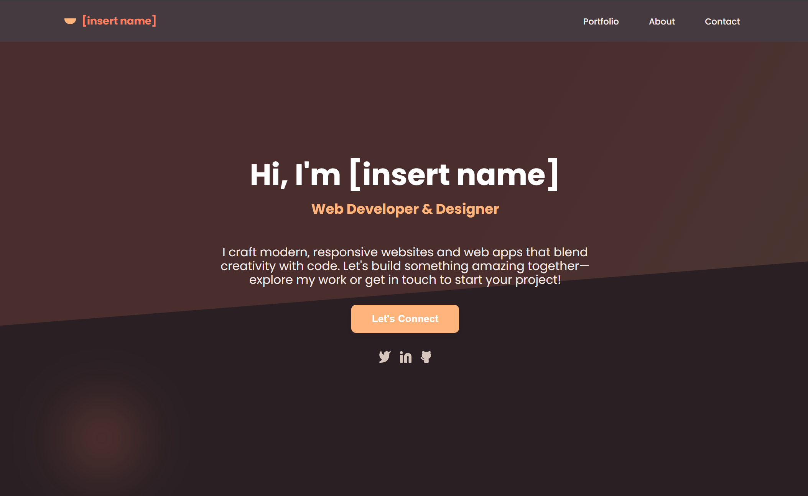

# [insert project name]

> [insert short project description]

## Built With

- HTML & CSS

## Live Demo

[Live Demo Link](https://your-demo-link-here)

## Preview Image

  
  

## Authors

👤 **Author 1**

- GitHub: [your-github-username](https://github.com/your-github-username)
- Twitter: [@your-twitter-handle](https://twitter.com/your-twitter-handle)
- LinkedIn: [your-linkedin-name](https://www.linkedin.com/in/your-linkedin-profile)

👤 **Author 2**

- GitHub: [coauthor-github-username](https://github.com/coauthor-github-username)
- Twitter: [@coauthor-twitter-handle](https://twitter.com/coauthor-twitter-handle)
- LinkedIn: [coauthor-linkedin-name](https://www.linkedin.com/in/coauthor-linkedin-profile)

## 🤝 Contributing

Contributions, issues, and feature requests are welcome!

Feel free to check the [issues page](../../issues/).

## Show your support

Give a ⭐️ if you like this project!

## 📝 License

This project is [MIT](./MIT.md) licensed.
